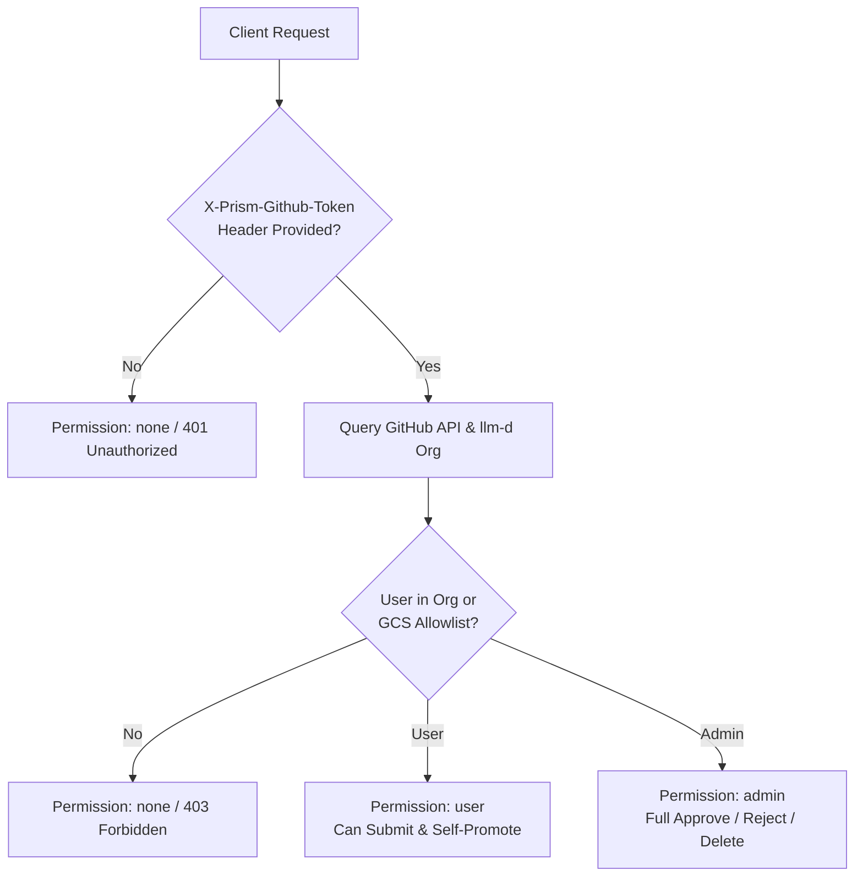
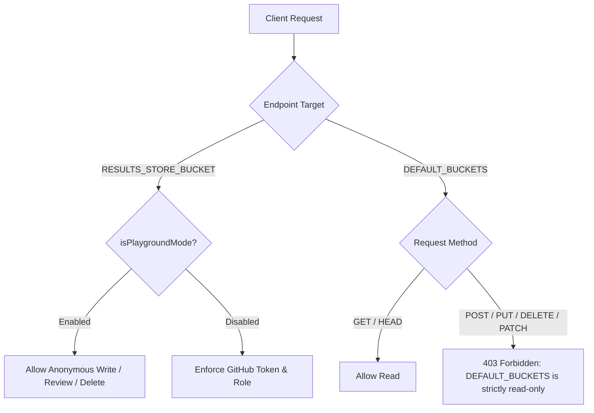
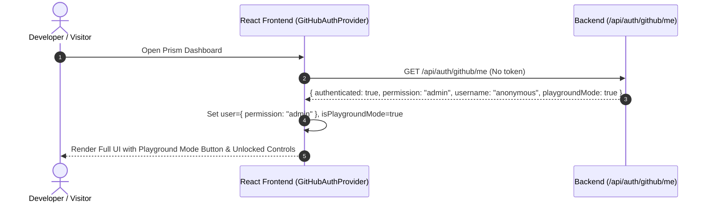

# Spec: Results Store Playground Mode (`RESULTS_STORE_PLAYGROUND_MODE=1`)

- **Status**: Implemented
- **Author**: diamondburned, Jetski
- **Date**: August 19, 2026

---

## 1. Objective

This proposal introduces a lightweight development configuration flag, `RESULTS_STORE_PLAYGROUND_MODE=1`, for Prism.

When active, this mode disables authentication and access control restrictions for the **writable Prism Results Store** (`RESULTS_STORE_BUCKET`). Any user accessing the Prism web UI or REST API—including unauthenticated local or public visitors—can submit, review, approve, promote, reject, or delete benchmark result bundles anonymously without creating or configuring a GitHub OAuth Application.

Crucially, **writes and deletions are strictly confined to `RESULTS_STORE_BUCKET`**. All catalog buckets defined in `DEFAULT_BUCKETS` remain permanently read-only.

### Goals

1. **Frictionless Local Development**: Allow developers to clone and run Prism locally (via Docker Compose or `npm run dev`) and test end-to-end benchmark workflows without needing a registered GitHub App, OAuth client credentials, or GCS IAM allowlist setup.
2. **Enabled by Default in Docker Compose**: Set `RESULTS_STORE_PLAYGROUND_MODE=1` by default in `docker-compose.yml` (while respecting any explicit environment variable override) to provide an out-of-the-box working development environment.
3. **Full UI & API Feature Parity**: Unlock all administrative capabilities in the UI (submitting runs, approving review queue items, promoting unlisted runs, rejecting runs, deleting runs) without requiring GitHub login.
4. **Subtle & Clean UI Experience**: Replace the GitHub login button in the Results Store header with a styled yellow-outline disabled button labeled **"Playground Mode"** that displays an explanatory tooltip on hover, avoiding intrusive site-wide warning banners.
5. **Strict Catalog Bucket Isolation**: Ensure buckets declared in `DEFAULT_BUCKETS` (e.g. `llm-d-benchmarks`) remain strictly read-only, preventing any accidental or intentional modification of reference catalog data.
6. **Preserve Data Integrity & Validation**: Maintain all automated structural and schema validations (`validatePrismUploadStructure`, BRV0.2 parsing, UUID validation) so that only valid benchmark bundles can be stored.

### Non-Goals

- Making `DEFAULT_BUCKETS` writable or deletable. `DEFAULT_BUCKETS` is always read-only.
- Disabling schema validation or structural checks. Badly formatted payloads will still be rejected with `400 Bad Request`.
- Changing production Cloud Run defaults. In production deployments where `RESULTS_STORE_PLAYGROUND_MODE` is not explicitly enabled, Prism enforces GitHub OAuth and GCS IAM allowlists.

---

## 2. Background & Architecture Overview

Currently, Prism enforces authentication and role-based access control (RBAC) on all mutating operations in the Results Store:



This architecture is documented in:
- [Prism Identity & Access Management (IAM)](../main/completed/results-api/iam.md)
- [Prism Cloud API Route Reference](../main/completed/results-api/routes.md)
- [Prism Results Store Specification](../main/completed/results-api/README.md)
- [Unlisted Benchmarks Specification](unlisted-benchmarks-spec.md)

Setting up GitHub OAuth requires creating a GitHub OAuth App, configuring redirect URLs (`http://localhost:8081/api/auth/github/callback`), providing client secrets, and provisioning test users in GCS allowlist files (`prism-iam/github-user-allowlist.txt`). For developers who simply want to test UI components, tune charts, or evaluate benchmark ingest pipelines, this creates unnecessary setup friction.

`RESULTS_STORE_PLAYGROUND_MODE=1` bypasses the GitHub OAuth and IAM check, granting anonymous administrative permissions over `RESULTS_STORE_BUCKET`.

---

## 3. Configuration & Activation

### Environment Variable

The mode is controlled via the environment variable `RESULTS_STORE_PLAYGROUND_MODE`.

| Value | Mode | Description |
| :--- | :--- | :--- |
| `1`, `true`, `yes`, `on` (case-insensitive) | **Playground Mode Active** | All ACL checks bypassed for `RESULTS_STORE_BUCKET`. Anonymous users granted administrative privileges in UI and API. |
| `0`, `false`, `no`, `off`, unset, or empty | **Standard Auth Mode** | Default behavior in production. GitHub OAuth and GCS IAM allowlists are strictly enforced. |

### Docker Compose Default

In `docker-compose.yml`, `RESULTS_STORE_PLAYGROUND_MODE` is enabled by default to ensure local development works out-of-the-box:

```yaml
services:
  app:
    environment:
      - GOOGLE_APPLICATION_DEFAULT_CREDENTIALS=/tmp/adc.json
      - PORT=3000
      - RESULTS_STORE_BUCKET=llm-d-benchmarks-staging
      - DEFAULT_BUCKETS=llm-d-benchmarks,llm-d-benchmarks-staging
      - RESULTS_STORE_PLAYGROUND_MODE=${RESULTS_STORE_PLAYGROUND_MODE:-1}
      - GITHUB_CLIENT_ID=${GITHUB_CLIENT_ID}
      - GITHUB_CLIENT_SECRET=${GITHUB_CLIENT_SECRET}
      - PUBLIC_URL=http://localhost:8081
```

### Server-Side Helper

A helper function in the backend resolves the mode:

```typescript
// server/iam.ts or server/buckets.js
export function isPlaygroundMode(): boolean {
    const val = String(process.env.RESULTS_STORE_PLAYGROUND_MODE || '').trim().toLowerCase();
    return val === '1' || val === 'true' || val === 'yes' || val === 'on';
}
```

---

## 4. Security & Storage Boundaries

The boundary between writable and read-only storage is strictly enforced at the API layer:



### Bucket Permission Matrix

| Bucket Category | Resolved Bucket | Read Operations (`GET`, `HEAD`, List) | Write Operations (`POST`, `PUT`, `PATCH`) | Delete Operations (`DELETE`) |
| :--- | :--- | :---: | :---: | :---: |
| **Prism Results Store** | `RESULTS_STORE_BUCKET` (e.g. `llm-d-benchmarks-staging`) | **Allowed** (Anonymous) | **Allowed** (Anonymous) | **Allowed** (Anonymous) |
| **Catalog Buckets** | `DEFAULT_BUCKETS` (e.g. `llm-d-benchmarks`) | **Allowed** (Anonymous) | **Blocked (403 Forbidden)** | **Blocked (403 Forbidden)** |
| **IAM Configurations** | `gs://<RESULTS_STORE_BUCKET>/prism-iam/*` | **Allowed** (Read-Only) | **Blocked (403 Forbidden)** | **Blocked (403 Forbidden)** |
| **Arbitrary External Buckets** | Any other GCS bucket | **Blocked (403 Forbidden)** | **Blocked (403 Forbidden)** | **Blocked (403 Forbidden)** |

---

## 5. API Endpoint Specifications

### 5.1 `GET /api/config`

The configuration endpoint surfaces `playgroundMode` so the frontend knows to adapt its auth UI.

- **Response (200 OK):**
  ```json
  {
      "buckets": ["llm-d-benchmarks"],
      "resultsStoreBucket": "llm-d-benchmarks-staging",
      "projects": [],
      "hostProject": "gke-gkit-dev",
      "siteName": "Prism Benchmark Staging",
      "gaTrackingId": null,
      "contactUrl": null,
      "localDir": false,
      "playgroundMode": true
  }
  ```

### 5.2 `GET /api/auth/github/me`

When `RESULTS_STORE_PLAYGROUND_MODE=1` is active, session resolution immediately short-circuits and makes **zero external calls to the GitHub API**. It returns a synthesized active administrative session regardless of headers:

- **Headers:** `X-Prism-Github-Token` (ignored)
- **Response (200 OK):**
  ```json
  {
      "authenticated": true,
      "configured": true,
      "username": "anonymous",
      "permission": "admin",
      "avatarUrl": null,
      "playgroundMode": true
  }
  ```

### 5.3 `POST /api/results` (Benchmark Submission)

Submits a new benchmark bundle to `RESULTS_STORE_BUCKET`.

- **Headers:** `X-Prism-Github-Token` (optional/ignored)
- **In-Memory Staging vs Submission Attribution:**
  - **Browser In-Memory Staging**: While staged locally in browser memory (`staged`), `github_author` is set to `null`.
  - **Submission Prompt**: The submission UI asks the user for an arbitrary author/contributor name (e.g. `"alice"`, `"team-alpha"`, or defaults to `"anonymous"`).
  - **Payload Server Mutation**: The server writes:
    ```json
    "github_author": {
        "username": "<entered_name>",
        "playground": true
    }
    ```
    The `$.github_author.playground = true` boolean property explicitly records that the benchmark was submitted under Playground Mode.
  - **GCS Custom Object Metadata Contexts**:
    - `customContexts.github_user.value = "<entered_name>"`
    - `customContexts.playground_submitted.value = "true"` (permanently marking the object in GCS as a playground upload).
- **Authorization:** Bypassed when `RESULTS_STORE_PLAYGROUND_MODE=1`. Submissions succeed without requiring allowlist membership.
- **Payload Validation:** Payload MUST strictly satisfy `PrismResultPayloadSchema` and BRV0.2 parsing rules.
- **Response (201 Created):**
  ```json
  {
      "success": true,
      "runId": "a1b2c3d4-e5f6-4a7b-8c9d-0e1f2a3b4c5d",
      "oldRunId": "client-staged-id",
      "state": "submitted_pending_review",
      "message": "Benchmark result successfully submitted and promoted to review."
  }
  ```

### 5.4 `GET /api/results` & `GET /api/results/:runId`

Lists and retrieves benchmark submissions from `RESULTS_STORE_BUCKET`.

- **Headers:** `X-Prism-Github-Token` (optional)
- **Behavior when `RESULTS_STORE_PLAYGROUND_MODE=1`:**
  - Anonymous callers are treated as administrators.
  - Queries return benchmark runs across all submission states (`submitted_pending_processing`, `submitted_pending_review`, `unlisted`, `public`, `promoted`, `rejected`) without filtering out pending items.
  - Single-run retrieval via `GET /api/results/:runId` succeeds for any benchmark run in `RESULTS_STORE_BUCKET`.

### 5.5 `POST /api/results/:runId/status` (Review & State Transitions)

Transitions the state of a benchmark result (e.g. approving, promoting, rejecting).

- **Headers:** `X-Prism-Github-Token` (optional)
- **Request Body:**
  ```json
  {
      "status": "public",
      "feedback": "Approved in Playground Mode",
      "reviewer": "anonymous"
  }
  ```
- **Authorization:** Bypassed when `RESULTS_STORE_PLAYGROUND_MODE=1`. Any caller can:
  - Approve runs (`submitted_pending_review` $\rightarrow$ `public` / `promoted`).
  - Reject runs (`submitted_pending_review` $\rightarrow$ `rejected`).
  - Promote unlisted runs (`unlisted` $\rightarrow$ `submitted_pending_review`).
  - Reset or resubmit runs (`rejected` $\rightarrow$ `submitted_pending_processing`).
- **Audit History:** The `review.history` entry records `by: reviewer || "anonymous"` and timestamp.

### 5.6 `DELETE /api/results/:runId` (Deletion)

Permanently deletes a benchmark result bundle from `RESULTS_STORE_BUCKET`.

- **Headers:** `X-Prism-Github-Token` (optional)
- **Authorization:** Bypassed when `RESULTS_STORE_PLAYGROUND_MODE=1`.
- **Target Restriction:** Deletes the corresponding JSON object in `RESULTS_STORE_BUCKET/prism-results-store/<runId>.v1.json`.
- **Response (200 OK):**
  ```json
  {
      "success": true,
      "message": "Benchmark a1b2c3d4-e5f6-4a7b-8c9d-0e1f2a3b4c5d successfully deleted."
  }
  ```

### 5.7 `ALL /api/gcs/*` (Direct GCS Proxy Guard)

The general GCS proxy handles raw storage requests. When `RESULTS_STORE_PLAYGROUND_MODE=1`:

1. **Read Requests (`GET`, `HEAD`)**:
   - Permitted for `RESULTS_STORE_BUCKET` and all `DEFAULT_BUCKETS`.
   - Results store list filtering is bypassed (returns all custom object contexts).
2. **Write / Delete Requests (`POST`, `PUT`, `DELETE`, `PATCH`)**:
   - **Target is `RESULTS_STORE_BUCKET`**:
     - Object path starts with `prism-results-store/`: **Permitted**.
     - Object path starts with `prism-iam/`: **Blocked (403 Forbidden)** to prevent corruption of allowlist files.
   - **Target is in `DEFAULT_BUCKETS`**:
     - **Blocked (403 Forbidden)** with message: `"Forbidden. DEFAULT_BUCKETS is strictly read-only."`
   - **Target is any other bucket**:
     - **Blocked (403 Forbidden)**.

### 5.8 `GET /api/avatar/:seed` (Playground Deterministic Avatar Endpoint)

Generates a deterministic, unique SVG avatar based on a seed or username (e.g. `anonymous`, `alice`, `team-alpha`).

- **Playground-Only Guard**: Only available when `RESULTS_STORE_PLAYGROUND_MODE=1`. When disabled (Standard Auth Mode), returns `500 Internal Server Error`.
- **Response**: `200 OK` with `Content-Type: image/svg+xml` and `Cache-Control: public, max-age=86400, immutable`.
- **Determinism**: The same username or seed string always yields the identical SVG avatar design.

---

## 6. Frontend & User Experience

### 6.1 Authentication State Hydration

In `GitHubAuthProvider.jsx`:

1. On mount, the provider calls `GET /api/auth/github/me` and `GET /api/config`.
2. When `playgroundMode: true` is returned:
   - `user` is set to `{ username: 'anonymous', permission: 'admin', avatarUrl: null }`.
   - `isAuthenticated` is set to `true`.
   - `isConfigured` is set to `true`.
   - `isPlaygroundMode` is set to `true`.



### 6.2 "Playground Mode" Header Button

In the Results Store header navigation (`ResultsStore.jsx`), instead of rendering a "Sign in with GitHub" button or unauthenticated placeholder:

- A **yellow-outline disabled button** labeled **"Playground Mode"** is rendered:
  ```jsx
  <div className="relative group/tooltip inline-block">
      <Button
          variant="outline"
          size="sm"
          disabled
          className="gap-2 select-none border-amber-500/40 text-amber-300 bg-amber-500/10 cursor-help disabled:opacity-100 font-semibold"
      >
          <Sparkles size={14} className="text-amber-400" />
          Playground Mode
      </Button>
      <div className="absolute right-0 top-full mt-2 px-3 py-2 bg-slate-900 border border-slate-800 text-slate-200 text-xs font-medium rounded-xl opacity-0 invisible group-hover/tooltip:opacity-100 group-hover/tooltip:visible transition-all duration-200 shadow-2xl z-[9999] w-72 pointer-events-none leading-relaxed text-left">
          <p className="font-semibold text-amber-300 mb-1">Playground Mode Active</p>
          Authentication is disabled. You can submit, review, approve, promote, and delete benchmarks in the Results Store without signing in.
      </div>
  </div>
  ```

### 6.3 Frictionless Benchmark Ingestion & Contributor Attribution

- **Browser In-Memory Staging**:
  - While files are staged locally in the browser (`staged`), `github_author` is explicitly set to `null` if `playgroundMode` is active.
- **Data Connections / Submit Validation Page**:
  - The submission workflow does not gate the user behind GitHub OAuth login.
  - Step 3 prompts the user with an input field for an arbitrary **Author / Contributor Name** (e.g. `"alice"`, `"team-alpha"`, defaulting to `"anonymous"` if left empty).
  - **DCO Omission**: The Developer Certificate of Origin (DCO) requirement, disclaimer text, and sign-off checkbox are completely hidden and bypassed in Playground Mode. Because Playground Mode operates anonymously and is not enforced, DCO sign-off is unnecessary and omitted to streamline testing.
  - The submit action is immediately enabled after passing automated validation without requiring DCO checkboxes or GitHub authentication.

### 6.4 Results Store Table & Filter Renaming

- **"Pending Benchmarks" KPI & Filter Tab**:
  - Because Playground Mode operates without a personal GitHub identity, the `"My Benchmarks"` / `"My Submissions"` tab and KPI card in `FilterPanel.jsx` is dynamically renamed to **`"Pending Benchmarks"`**.
  - Selecting `"Pending Benchmarks"` filters the catalog to show all benchmarks in non-public review states (`staged`, `unlisted`, `submitted_pending_processing`, `submitted_pending_review`, `rejected`).
- **Plain Text Username Rendering & Custom Avatars**:
  - Usernames in benchmark tables and cards are rendered as plain text rather than linked GitHub URLs (`<a>`), keeping the exact same typography and text color while removing link underlines and highlights.
  - Avatar images for benchmark contributors use the deterministic `/api/avatar/:seed` endpoint instead of resolving against `github.com/<username>.png`.
- **Results Store Actions & Review Drawer**:
  - All action controls (**Approve**, **Reject**, **Delete**, **Promote to Review**, **Resubmit**) are fully interactive for all visitors.
  - Reviewer attribution defaults to `anonymous`.

---

## 7. Comparative Feature Matrix

| Feature / Behavior | Standard Auth Mode (`RESULTS_STORE_PLAYGROUND_MODE=0`) | Playground Mode (`RESULTS_STORE_PLAYGROUND_MODE=1`) |
| :--- | :--- | :--- |
| **GitHub OAuth Requirement** | Mandatory for submissions and reviews | **Disabled (Zero external GitHub calls)** |
| **Default Visitor Role** | `permission: 'none'` | **`permission: 'admin'`** |
| **Header Button** | "Sign in with GitHub" / User Profile Avatar | **"Playground Mode" (Tag + Tooltip)** |
| **Filter Tab Name** | `"My Benchmarks"` | **`"Pending Benchmarks"`** |
| **Username Rendering** | GitHub profile link (`https://github.com/<user>`) | **Plain text (Identical color, no link)** |
| **Contributor Avatar Source** | `https://github.com/<user>.png` | **`/api/avatar/:seed` (Custom SVG generator)** |
| **`/api/avatar/:seed` Endpoint** | **Disabled (500 Error)** | **Active (Deterministic SVG avatars)** |
| **Staged `github_author`** | Logged-in GitHub username | **`null` in browser memory** |
| **Submission Attribution** | Enforced GitHub username | **Arbitrary name (`playground: true`)** |
| **Developer Certificate of Origin (DCO)** | Mandatory checkbox & signature required | **Completely hidden & omitted** |
| **GCS Metadata Tracking** | `github_user: <username>` | `github_user: <name>`, `playground_submitted: "true"` |
| **Submit to Results Store** | Allowlisted `user` or `admin` only | **Any visitor (Anonymous / Custom Name)** |
| **Approve / Reject Benchmarks** | `admin` only | **Any visitor (Anonymous)** |
| **Delete from Results Store** | Owner (`unlisted`) or Admin (`unlisted`/`rejected`) | **Any visitor (Anonymous)** |
| **List Pending Review Benchmarks** | Admin (all) or Submitter (own) | **All visitors (All runs visible)** |
| **`RESULTS_STORE_BUCKET` Mutability** | Authorized GitHub users only | **Anonymous writes allowed** |
| **`DEFAULT_BUCKETS` Mutability** | **Read-Only** | **Read-Only (Strictly Enforced)** |
| **`prism-iam/*` Mutability** | Admin only | **Read-Only Protected** |
| **Schema Validation Checks** | Enforced (`400 Bad Request` on failure) | **Enforced (`400 Bad Request` on failure)** |

---

## 8. Implementation Details

### File Modifications

1. **`server/iam.ts`**:
   - Add `isPlaygroundMode(): boolean`.
   - In `validateGitHubUser()`, if `isPlaygroundMode()` is true, return `'admin'` without checking GCS allowlists.
2. **`server/oauth.ts`**:
   - In `/api/auth/github/me`, check `isPlaygroundMode()`. If active, immediately return `{ authenticated: true, configured: true, username: 'anonymous', permission: 'admin', avatarUrl: '/api/avatar/anonymous', playgroundMode: true }` without making any calls to the GitHub API.
3. **`server/avatar.ts`**:
   - Add `generateSvgAvatar(seed: string): string` generating deterministic 5x5 identicons with vibrant gradients.
   - Register `GET /api/avatar/:seed` returning SVG; rejects with 500 error if playground mode is disabled.
4. **`server/results/api.ts`**:
   - Extend `github_author` schema with optional `playground: z.boolean().optional()`.
   - Extend `PrismResultContextSchema` with optional `playground_submitted: ContextValueSchema.optional()`.
5. **`server/results/gcs.ts`**:
   - When writing a submission in playground mode, write `playground_submitted: { value: 'true' }` to GCS object custom contexts.
6. **`server/server.js`**:
   - In `GET /api/config`, include `playgroundMode: isPlaygroundMode()`.
   - Mount `avatarRouter` for `/api/avatar/:seed`.
   - In `ALL /api/gcs/*`, allow anonymous writes only to `RESULTS_STORE_BUCKET` under `prism-results-store/*`; strictly forbid non-read methods on `DEFAULT_BUCKETS` or `prism-iam/*`.
7. **`server/results/routes/submit.ts`**:
   - If `isPlaygroundMode()`, allow missing token and set `uploadData.github_author = { username: uploadData.github_author?.username || 'anonymous', playground: true }`.
8. **`server/results/routes/review.ts`**:
   - If `isPlaygroundMode()`, allow missing token and permit any state transition. Default reviewer to `'anonymous'`.
9. **`server/results/routes/delete.ts`**:
   - If `isPlaygroundMode()`, allow missing token and permit deletion of any benchmark in `RESULTS_STORE_BUCKET`.
10. **`server/results/routes/list.ts` & `get.ts`**:
    - If `isPlaygroundMode()`, default unauthenticated permission to `'admin'`.
11. **`docker-compose.yml`**:
    - Add `RESULTS_STORE_PLAYGROUND_MODE=${RESULTS_STORE_PLAYGROUND_MODE:-1}`.
12. **`src/components/GitHubAuthProvider.jsx`**:
    - Set `isPlaygroundMode: true` and hydrate anonymous admin when `playgroundMode` is reported by the server.
13. **`src/components/ResultsStore.jsx`**:
    - Render the yellow-tag "Playground Mode" indicator with tooltip in place of the login button.
14. **`src/components/ManageBenchmarks/FilterPanel.jsx`**:
    - When `isPlaygroundMode` is true, rename `"My Benchmarks"` tab to `"Pending Benchmarks"` and show pending review runs.
15. **`src/components/ManageBenchmarks/UnifiedDataTable.jsx` & `src/components/Dashboard/UnifiedDataTable.jsx`**:
    - In playground mode, render usernames as plain text (no GitHub links) and load custom SVG avatars from `/api/avatar/:seed`.
16. **`src/components/DataConnections/SubmitValidationPage.jsx`**:
    - Set `github_author: null` while staged in memory; prompt for arbitrary author handle on submission; hide DCO checkbox and section completely in playground mode.

---

## 9. Verification & Testing Plan

### Automated Backend Tests

1. **Configuration & Role Resolution Tests**:
   - Set `RESULTS_STORE_PLAYGROUND_MODE=1`.
   - Verify `GET /api/config` returns `playgroundMode: true`.
   - Verify `GET /api/auth/github/me` (without `X-Prism-Github-Token`) returns `authenticated: true`, `permission: "admin"`, `playgroundMode: true`.
2. **Anonymous Submission & Review Workflow**:
   - Send `POST /api/results` with valid BRV0.2 payload and no token $\rightarrow$ verify `201 Created` and state `submitted_pending_review`.
   - Send `POST /api/results/:runId/status` with `{ "status": "public" }` and no token $\rightarrow$ verify `200 OK` and updated status.
   - Send `DELETE /api/results/:runId` with no token $\rightarrow$ verify `200 OK` and object removal.
3. **Storage Boundary Enforcement Tests**:
   - Send `PUT /api/gcs/<DEFAULT_BUCKET>/test.json` $\rightarrow$ verify `403 Forbidden`.
   - Send `DELETE /api/gcs/<DEFAULT_BUCKET>/test.json` $\rightarrow$ verify `403 Forbidden`.
   - Send `POST /api/gcs/<RESULTS_STORE_BUCKET>/prism-iam/github-admin-allowlist.txt` $\rightarrow$ verify `403 Forbidden`.
   - Send `PUT /api/gcs/<RESULTS_STORE_BUCKET>/prism-results-store/<runId>.v1.json` $\rightarrow$ verify `200 OK`.
4. **Data Validation Integrity**:
   - Send malformed payload to `POST /api/results` $\rightarrow$ verify `400 Bad Request`.

### Frontend E2E / Browser Verification

- Navigate to `http://localhost:8081` with Docker Compose default settings.
- Verify the yellow-outline "Playground Mode" button is displayed in the header.
- Hover over the button and verify the tooltip explains the anonymous writable access.
- Upload a benchmark bundle, verify it completes without login, and verify approval actions function in the Results Store table.
