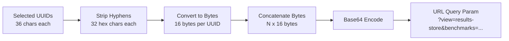
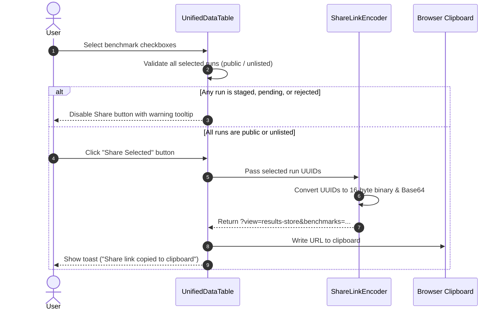
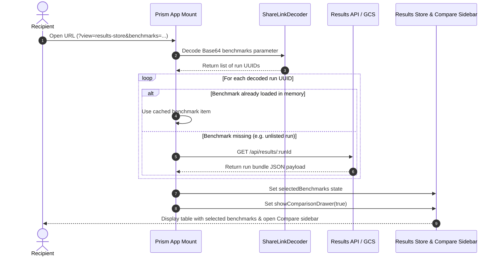

# Spec: Multi-Benchmark Compact Share Links & Automated Comparison

- **Status**: Draft
- **Author**: diamondburned, Jetski
- **Date**: July 31, 2026

## Objective

This proposal introduces a multi-benchmark sharing mechanism for the Prism Results Store.

Users can select multiple benchmark runs in the Results Store table, generate a compact share link containing binary Base64-encoded benchmark UUIDs, and share it with collaborators. When a recipient opens the link, Prism automatically navigates to the Results Store, fetches and selects the specified benchmarks, and opens the Compare sidebar for immediate side-by-side analysis.

The key goals of this feature are:

1. **Multi-Benchmark URL Sharing**: Allow users to share combinations of public and unlisted benchmark runs via a single URL.
4. **Automated Compare Sidebar Activation**: Automatically select the shared runs and launch the Compare sidebar upon link navigation.

Non-goals:

- Supporting share links for browser-local `staged` benchmark runs (staged data resides only in the submitter's browser IndexedDB).
- Supporting share links for runs in the administrator review queue (`submitted_pending_review`) or rejected queue (`rejected`).
- Creating a separate database table or short-URL alias redirect backend service (compact binary encoding keeps URLs small without requiring server-side link resolution storage).

---

## Background

Currently, users in the Prism Results Store can select multiple benchmarks from the table to perform side-by-side analysis using the Compare & Inspect drawer (`setShowComparisonDrawer(true)`). However, there is no direct mechanism to copy a shareable link that preserves this selection state for collaborators.

While individual unlisted runs can be accessed via `/results/:runId` direct links (as specified in [unlisted-benchmarks-spec.md](unlisted-benchmarks-spec.md)), comparing multiple benchmark runs requires manual re-selection by each team member.

Providing a share button on the selection toolbar with compact binary Base64 UUID encoding solves this gap while keeping URLs concise and URL-bar friendly.

For related context, see:
- [Prism Results Store Specification](../main/completed/results-api/README.md)
- [Frontend Architecture Specification](../main/completed/results-api/frontend.md)
- [API Route Reference](../main/completed/results-api/routes.md)
- [Unlisted Benchmarks Specification](unlisted-benchmarks-spec.md)

---

## Visibility & Authorization Constraints Matrix

Sharing is governed by strict visibility rules to prevent leaking preliminary, browser-local, or review-queue benchmark runs.

### Visibility Rules

| Submission State | Share Link Allowed? | Enforcement Strategy |
| :--- | :--- | :--- |
| `public` | **Yes** | Fully shareable across all users. |
| `unlisted` | **Yes** | Fully shareable via direct link (unlisted benchmarks are cloud-backed and accessible to anyone with the UUID). |
| `staged` | **No (Forbidden)** | Blocked. Staged data exists only in local IndexedDB. |
| `submitted_pending_processing` | **No (Forbidden)** | Blocked. Upload is in transient processing state. |
| `submitted_pending_review` | **No (Forbidden)** | Blocked. Run is in admin review queue; restricted to owner and admins. |
| `rejected` | **No (Forbidden)** | Blocked. Run was rejected during review. |

### Validation Rule

When a user selects benchmarks in the UI and attempts to generate a share link, the client evaluates the submission state of every selected run:

```typescript
function canShareBenchmarks(selectedRuns: BenchmarkRun[]): boolean {
  if (selectedRuns.length === 0) return false;

  return selectedRuns.every(run => {
    const status = getSubmissionStatus(run);
    return status === 'public' || status === 'unlisted';
  });
}
```

If `canShareBenchmarks(selectedRuns)` returns `false`:
- The "Share Selected" action is **disabled** with an explanatory tooltip, OR
- Clicking the action triggers a warning alert/toast: *"Sharing is forbidden: Selection contains staged, pending review, or rejected runs. Only public and unlisted benchmarks can be shared."*

---

## Compact Binary Base64 Encoding Specification

Standard UUID v4 strings consume 36 ASCII characters (e.g. `123e4567-e89b-12d3-a456-426614174000`), representing 128 bits (16 bytes) of binary data. Passing comma-separated raw UUID text strings in URL query parameters scales poorly as the number of selected benchmarks increases.

To minimize URL length, benchmark UUIDs are serialized directly into binary byte arrays before Base64 encoding.

### Target URL Format

```
/?view=results-store&benchmarks=<Base64String>
```

Example:
`/?view=results-store&benchmarks=EJ5FZ-i7EdOkVkJmFBdAABE-hX7ruxF2pFiC`

### Encoding Algorithm (Client Link Generation)

Given an array of selected benchmark UUID strings `[uuid_1, uuid_2, ..., uuid_N]`:

1. **UUID to Bytes**: Convert each 36-character UUID string (format `8-4-4-4-12`) into a 16-byte `Uint8Array`:
   - Remove hyphens `-` to obtain a 32-character hexadecimal string.
   - Parse hexadecimal pairs into 16 raw byte values.
2. **Concatenation**: Combine all `N` 16-byte arrays into a single contiguous `Uint8Array` of total length `16 * N` bytes.
3. **Base64 Encoding**: Encode the concatenated byte array into a Base64 URL-safe string (padding characters `=` may be retained or standard URL encoding applied).



### Decoding Algorithm (Client Navigation Handler)

When opening a link containing `?view=results-store&benchmarks=<Base64String>`:

1. **Extract Parameter**: Read the `benchmarks` parameter from `window.location.search`.
2. **Base64 Decoding**: Decode the Base64 string into a `Uint8Array`.
3. **Byte Alignment Validation**:
   - Check if `bytes.length > 0` and `bytes.length % 16 === 0`.
   - If validation fails (corrupted string or invalid length), log an error, trigger an error toast (*"Invalid benchmark share link"*), and fall back to the default Results Store view.
4. **Byte Splitting & UUID Reconstruction**:
   - Iterate over the byte array in 16-byte chunks (`i = 0, 16, 32, ...`).
   - Convert each 16-byte slice into a 32-character hexadecimal string.
   - Format into canonical UUID string representation (`8-4-4-4-12`):
     `xxxxxxxx-xxxx-xxxx-xxxx-xxxxxxxxxxxx`
5. **Output**: An array of canonical UUID strings `[uuid_1, uuid_2, ..., uuid_N]`.

### Compact Size Comparison

| Number of Benchmarks (`N`) | Raw ASCII Comma-Separated | Compact Binary Base64 | Reduction |
| :---: | :---: | :---: | :---: |
| 1 | 36 chars | 24 chars | 33% smaller |
| 3 | 110 chars | 64 chars | 42% smaller |
| 5 | 184 chars | 108 chars | 41% smaller |
| 10 | 369 chars | 216 chars | 41% smaller |

---

## User Experience & Workflow

### Link Generation Workflow

1. **Selection**: User navigates to `/?view=results-store` and checks $N$ rows in `UnifiedDataTable.jsx`.
2. **Toolbar Update**: The selection action bar displays the total selected count and available bulk actions.
3. **Validation Check**:
   - If all selected benchmarks have state `public` or `unlisted`, the **Share Link** button is enabled.
   - If any selected benchmark is `staged`, `submitted_pending_review`, or `rejected`, the **Share Link** button displays a disabled state with a descriptive tooltip or warning icon.
4. **Copy Action**:
   - Clicking **Share Link** executes the binary Base64 encoding algorithm.
   - Constructs the full URL: `https://<domain>/?view=results-store&benchmarks=<encoded_string>`.
   - Copies the URL to the user's clipboard and displays a success toast notification (*"Share link copied to clipboard"*).



### Link Consumption & Automated Compare Sidebar Workflow

1. **Navigation**: Recipient opens `https://<domain>/?view=results-store&benchmarks=<encoded_string>`.
2. **State Hydration**:
   - Prism initializes and detects `view=results-store` and `benchmarks` query parameters on mount.
   - Calls the decoder to extract the array of target run UUIDs.
3. **Data Resolving**:
   - Prism checks existing in-memory / IndexedDB cached runs for matching UUID keys.
   - For any target UUID not currently present in the client catalog (such as `unlisted` runs hidden from default grid lists), Prism fetches the run bundle via `GET /api/results/:runId`.
4. **Selection & Compare Activation**:
   - Prism populates `selectedBenchmarks` with the retrieved benchmark keys.
   - Prism automatically opens the Compare sidebar (`setShowComparisonDrawer(true)`).
   - Displays an informational toast (*"Loaded N shared benchmarks into Compare view"*).



---

## Edge Cases & Error Handling

1. **Malformed Base64 Parameter**:
   - If `benchmarks` parameter is corrupted or byte length is not a multiple of 16, Prism displays an error notification: *"Invalid share link format"*.
   - Navigation gracefully defaults to the normal Results Store view without crashing.
2. **Deleted or Non-Existent Benchmark UUID**:
   - If one of the decoded UUIDs returns 404 Not Found (e.g. an unlisted benchmark deleted by its owner), Prism skips the missing run, loads the remaining valid runs into the Compare sidebar, and displays a warning toast: *"1 shared benchmark could not be found or was deleted"*.
3. **Access Restricted Benchmark**:
   - If a share link contained a run ID that transitioned to pending review or private access and returns HTTP 403, it is safely excluded from selection with an appropriate notice.
4. **Empty Selection**:
   - Navigating to `?view=results-store&benchmarks=` with an empty string triggers standard Results Store view without opening the Compare sidebar.
