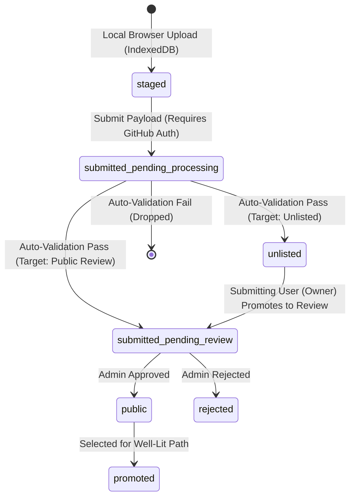

# Spec: Unlisted Status for Prism Results Store Benchmarks

- **Status**: Draft
- **Author**: diamondburned, Jetski
- **Date**: July 31, 2026

## Objective

This proposal introduces an **Unlisted** benchmark submission state (`unlisted`)
for the Prism Results Store.

Currently, benchmark runs uploaded to Prism Cloud move directly from automated
validation into the human review queue (`submitted_pending_review`), where they
await administrator approval to become `public`. There is no cloud-backed middle
ground for storing preliminary, unverified, or experimental benchmark data
without submitting it for formal public review.

The goals of this feature are:

1. Provide a cloud-backed storage state (`unlisted`) in Google Cloud Storage
   (GCS) that skips human review.
2. Serve as a data playground for bad, unverified, or preliminary benchmark data
   without cluttering the main public benchmark catalog.
3. Allow contributors to generate and copy direct share links
   (`/results/:runId`) for unlisted benchmarks to collaborate with team members.
4. Allow the submitting user (owner) to promote their unlisted benchmark to
   `submitted_pending_review` whenever they verify the data quality and are
   ready for public review.

Non-goals:

- Making unlisted benchmarks secret or private (unlisted data is accessible to
  anyone holding a direct link or explicitly querying `status=unlisted`, but is
  hidden by default from the general public explore grid).
- Allowing administrators to manage or promote unlisted benchmarks (owner
  self-promotion governs unlisted transitions; admin review is reserved for
  approving items in the review queue).

---

## Background

The Results Store backend uses GCS to store run result bundles as JSON files
(`prism-results-store/<benchmarkID>.v1.json`) and relies on GCS custom object
metadata contexts (`submission_state`, `github_user`, `model_name`,
`hardware_name`) for fast server-side filtering.

Currently, the submission pipeline follows a strict two-stage path:

- **`staged`**: Stored locally in the user's browser (IndexedDB). Cannot be
  shared via URL.
- **`submitted_pending_processing`** $\rightarrow$
  **`submitted_pending_review`**: Uploaded to Prism Cloud, validated, and placed
  in the admin review queue.

This structure creates friction when contributors have benchmark runs that they
want stored on the backend and shared with teammates, but aren't certain whether
the data quality is solid enough for public review. Introducing `unlisted`
resolves this gap.

For related details, see the canonical
[Prism Results Store Specification](../main/completed/results-api/README.md),
[API Route Reference](../main/completed/results-api/routes.md),
[Frontend Architecture Spec](../main/completed/results-api/frontend.md), and
[Identity & Access Management Spec](../main/completed/results-api/iam.md).

---

## Lifecycle State Machine & Visibility Matrix

### State Machine

### State & Visibility Matrix

| Property                            | `staged`                       | `unlisted`                                             | `submitted_pending_review`                    | `public`                    |
| :---------------------------------- | :----------------------------- | :----------------------------------------------------- | :-------------------------------------------- | :-------------------------- |
| **Storage Location**                | Local Browser (IndexedDB)      | Prism Cloud GCS Bucket                                 | Prism Cloud GCS Bucket                        | Prism Cloud GCS Bucket      |
| **Human Review**                    | None                           | **Skipped** (Automated processing only)                | Queued for Admin Review                       | Approved                    |
| **Visible to Guest/User**           | Browser-local only             | **Yes** (Via share link or explicit `status=unlisted`) | **No** (Owner only)                           | **Yes** (Public)            |
| **Visible to Admin**                | Browser-local only             | Yes                                                    | **Yes** (All review queue items)              | Yes                         |
| **Hidden by Default in Main Grid?** | N/A                            | **Yes**                                                | Yes                                           | **No** (Visible by default) |
| **Promoted By**                     | Owner $\rightarrow$ Processing | **Owner** $\rightarrow$ `submitted_pending_review`     | **Admin** $\rightarrow$ `public` / `rejected` | N/A                         |

---

## Behavioral & Functional Requirements

### 1. Ingestion & Target Visibility Selection

- During the submission process (in the submission wizard), authenticated
  contributors select their desired target visibility:
    - **Save as Unlisted**: Validates data and stores the benchmark directly as
      `unlisted` in GCS, skipping human review.
    - **Submit for Public Review**: Validates data and places the benchmark into
      `submitted_pending_review`.
- All uploads undergo automated format and metric integrity checks
  (`validatePrismUploadStructure`). Submissions that fail validation are dropped
  immediately, returning HTTP 400.

### 2. Access Control & Direct Link Sharing

- **Not Secret, Hidden by Default**: `unlisted` benchmarks are not secret.
  Anyone with a direct link (`/results/:runId` or `GET /api/results/:runId`) or
  who explicitly filters by `status=unlisted` can read the benchmark payload.
- **Default Grid Filtering**: General list queries (such as the default public
  exploration grid) exclude `unlisted` benchmarks to prevent unverified data
  from cluttering public results.
- **Review Queue Restrictions**: The pending review queue
  (`submitted_pending_review`) remains restricted: only **Admins** can view all
  items in pending review, while non-admin submitters can only view their own
  items under review (`own=true`).

### 3. Owner Self-Promotion & Management Workflow

- The **submitting user (owner)** retains full control over their unlisted
  benchmarks.
- **Promotion**: When an owner verifies that their unlisted benchmark data is
  accurate, they can promote it from `unlisted` $\rightarrow$
  `submitted_pending_review` via a single promote action button ("Promote to
  Review").
    - **No Feedback or Reason Input**: Owner promotion is a single-click status
      transition that requires no reasons or feedback text. In
      `POST /api/results/:runId/status`, `feedback` and `reviewer` fields are
      unused and forbidden for this transition.
- **Deletion**: Submitting users (owners) can permanently delete their own
  unlisted benchmarks via `DELETE /api/results/:runId`. Admins can also delete
  unlisted benchmarks.
- Promoting an unlisted benchmark places it into the administrator review queue.
  Administrators then review and approve the run to `public` or reject it to
  `rejected`.
- Administrators do not manage or promote unlisted benchmarks directly; unlisted
  management is entirely owner-driven.
