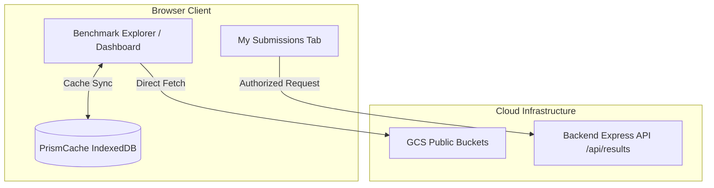

# Frontend Architecture & Implementation Details

This document specifies the frontend implementation of the GitHub OAuth SSO mechanism, data retrieval strategies, local caching, and submission management within the Prism dashboard.

---

## 1. Data Retrieval Strategies & Architecture

Prism employs two distinct data ingestion paths on the frontend, optimized for public explore speed vs. authenticated user history:



### 1.1 Benchmark Explorer (GCS Direct Ingestion)
The main Benchmark Explorer and charts load directly from GCS to bypass backend serialization overhead:
- **Mechanism:** Uses the `useGCS` hook to query the Google Cloud Storage JSON API directly (`GET https://storage.googleapis.com/storage/v1/b/<bucketName>/o`).
- **Parsing:** Handles legacy JSON benchmarks, raw text execution logs, and new Results-Store format runs (`.v1.json`) containing Benchmark Report v0.2 stages.
- **Caching:** Directory lists and parsed telemetry entries are saved locally in an IndexedDB database named `PrismCache` managed by `cacheManager.jsx`.
- **Force Refresh:** A reload icon next to GCS connection cards triggers a force refresh (`forceRefresh = true`), bypassing the IndexedDB cache and querying GCS fresh.
- **Pagination Limit:** GCS listing currently fetches the entire file list in a single request. **No pagination or infinite scrolling is implemented yet** for GCS-backed explorer views.

### 1.2 My Submissions (API History)
The My Submissions tab in the Manage Benchmarks view lists historical runs submitted by the user:
- **Mechanism:** Calls the backend Results API (`GET /api/results?own=true`).
- **Authentication:** Enforces GitHub OAuth login; the user's token is passed via the `X-Prism-Github-Token` header.
- **Pagination:** Supports backend page tokens. Loads 20 items per page; a "Load More Submissions" button appears at the bottom of the table if the API returns a non-null `nextPageToken`.
- **Filter Constraints:** The results API only supports status (`status`) and ownership (`own`) filters. If any advanced dashboard filter (e.g., Model or Accelerator) is active, the client disables fetching from `/api/results`, hides the submissions table, and displays an alert card prompting the user to clear active filters.

---

## 2. GitHub OAuth SSO

### 2.1 Backend OAuth Redirect (`GET /api/auth/github/callback`)
If GitHub App "Expire user authorization tokens" is enabled, the backend exchanges the OAuth authorization code for an access token and a refresh token.

The redirect URL to the frontend is extended to redirect to the Manage Benchmarks view (`?view=manage-benchmarks`) and include token lifetime information in the hash fragment:
```
#access_token=<token>&refresh_token=<token>&expires_in=<seconds>&refresh_token_expires_in=<seconds>&state=<state>
```

### 2.2 Token Refresh Endpoint (`POST /api/auth/github/refresh`)
A backend endpoint is exposed to facilitate access token renewal using a refresh token.

*   **URL:** `/api/auth/github/refresh`
*   **Method:** `POST`
*   **Request Headers:** `Content-Type: application/json`
*   **Request Body:**
    ```json
    {
      "refresh_token": "<refresh_token>"
    }
    ```
*   **Response (200 OK):**
    ```json
    {
      "access_token": "<new_access_token>",
      "expires_in": 28800,
      "refresh_token": "<new_refresh_token>",
      "refresh_token_expires_in": 15811200
    }
    ```
*   **Response (501 Not Implemented):** Returned if GitHub OAuth is not configured.
*   **Response (400/500):** Returned if refresh fails.

---

## 3. Frontend Token Lifecycle & Storage

### 3.1 Local Storage Schema
Tokens are stored in the browser's `localStorage` under the following keys:
*   `prism_github_access_token`: The current access token string.
*   `prism_github_refresh_token`: The current refresh token string.
*   `prism_github_access_token_expires_at`: Absolute ISO timestamp (e.g., `2026-07-08T23:59:00Z`) when the access token expires.
*   `prism_github_refresh_token_expires_at`: Absolute ISO timestamp when the refresh token expires.

### 3.2 Token Parse Flow
Upon mounting the main app, the URL hash fragment is checked for OAuth tokens:
1. Parse hash parameters: `access_token`, `refresh_token`, `expires_in`, `refresh_token_expires_in`.
2. If `access_token` is present:
    - Save to `localStorage`.
    - If `expires_in` is present, compute and save `expires_at` (Current Time + `expires_in` seconds).
    - Save `refresh_token` if present.
    - If `refresh_token_expires_in` is present, compute and save `refresh_token_expires_at`.
3. Clear the hash fragment from the browser URL to keep it clean.

### 3.3 Auto-Renewal Flow
A background timer checks the access token status:
- The token is renewed if it is close to expiration (e.g., less than 5 minutes remaining).
- If the access token is expired but a valid refresh token exists, it is renewed.
- Renewal calls `POST /api/auth/github/refresh` with the stored `refresh_token`. The returned payload is saved in `localStorage`, updating the keys and expiration timestamps.
- If renewal fails or the refresh token itself is expired, the session is cleared, and the user must re-authenticate.

### 3.4 Redirect State Tracking
To preserve UI state across the external OAuth redirect:
1. When initiating the login flow, a flag `prism_show_submit_dialog_after_login` is set to `"true"` in `sessionStorage`.
2. Upon redirecting back from GitHub, the app loads the `manage-benchmarks` view.
3. The `ManageBenchmarks` page checks `sessionStorage` on mount. If the flag is set, it automatically re-opens the Submit dialog and clears the flag.

---

## 4. UI/UX Specifications (Manage Benchmarks Page)

### 4.1 Header/Sidebar Submit Button
A new **Submit** button is added next to the **Upload** and **Connections** buttons in the header section of the Manage Benchmarks page.

*   **States:**
    1.  **Disabled (Greyed Out):** If the backend does not have GitHub OAuth configured (determined by a `501` status code from `/api/auth/github/me` or `/api/auth/github/refresh` check).
        *   **Tooltip on Hover:** `"GitHub is not yet configured on Prism."`
    2.  **Enabled:** If GitHub OAuth is configured on the backend.
        *   **Action:** Opens the **Submit & OAuth Dialog**.

### 4.2 Submit & OAuth Dialog
When the "Submit" button is clicked:
1.  **If Not Logged In:**
    - Show prompt: `"GitHub Authorization Required"`.
    - Description: `"Prism uses GitHub SSO to attribute benchmark submissions. Please sign in to continue."`
    - Button: `"Log in with GitHub"`. Clicking this opens the login flow (`/api/auth/github/login`).
2.  **If Logged In:**
    - Show current user's profile info (avatar, username) fetched from `/api/auth/github/me`, and lists the user's role/permission level (e.g. Admin, User).
    - If the user role is unauthorized (not `user` or `admin`), display an access restriction message.
    - **Step 1: Review & Validation:**
        - Displays the list of selected staged runs.
        - Runs `validatePrismUploadStructure(payload, { isUpload: true })` on each run.
        - Displays readiness tags for each card (Format, Model, Hardware) and a status badge:
            - **Ready** (green): Validation passed without errors or warnings.
            - **Warnings** (amber): Validation passed, but contains non-blocking optimization warnings (missing well-lit path category, missing evidence logs, or missing deployment manifests).
            - **Invalid** (red): Validation failed due to format mismatches, negative metrics, or syntax errors.
        - Each run row is expandable to reveal the full list of warnings, errors, and metadata details.
        - **Next Button:** Prompts the user to proceed to Step 2. If any selected run has critical validation errors, the button is disabled and a blocking alert is shown.
    - **Step 2: DCO & Terms Agreement:**
        - Displays the **Developer Certificate of Origin (DCO)**.
        - Displays the **Terms of Publication & Cloud Storage** (stating that all benchmarks are permanently attributed to the user's GitHub username and data may be published publicly on Prism dashboards).
        - Includes an agreement checkbox: `"I accept the terms & certify the origin of this submission."`
        - **Submit Button:** Submits the benchmarks to the cloud store via `POST /api/results`. Disabled until the agreement checkbox is checked. Shows a loading spinner and handles multi-run sequential uploads. If any submission fails, returns to Step 1 and displays the error message.
        - **ID Promotion & Local Cleanup:** Upon successful submission of a staged run, the client removes the staged run from browser local storage staging. To preserve user modifications (such as custom labels, baseline selection, or stage filters) under the new ID, the client re-keys these settings from the temporary staged ID to the server-assigned UUID in local storage before deletion.
